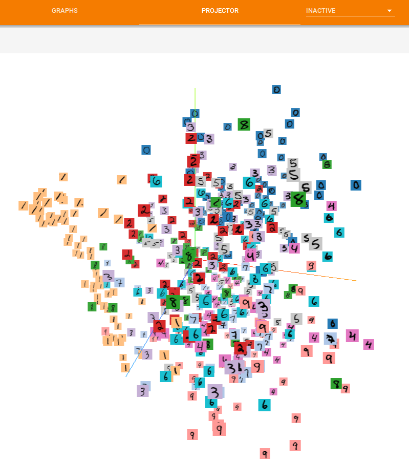

# TensorFlow-Examples

## Enviroment

OS: Ubuntu 16.04

Python3.x

## Examples

### 01-Linear regression

Implementing linear regression using TensorFlow. The training result is compared with the result of **least squares regression** which is a standard approach of overdetermined systems.

### 02-Preparing data

- Image processing: Using TensorFlow native functions to process the images.

- Queue and Thread: Some examples of TensorFlow **FIFOQueue**, **QueueRunner**, **Coordinator**.

- Simple data: Writing and reading TFRecord file. 

- MNIST: Transfering MNIST dataset to several TFRecord files and read these files with multiple threads.

- CIFAR10: Pseudo example of reading CIFAR10 dataset.

### 03-Model and parameters

Saving and loading the tensor with checkpoint. Reusing the variable in the specific scopes.

### 04-Args

Parsing the arguments with **argparse** and **tf.app.flags**.

### 05-MNIST

Training MNIST dataset with a simple neural network and a simple cnn model.

### 06-Classic models

Trying to implement the classic models without using high-level API.

### 07-TensorBoard

Visualizing the training model and data with TensorBoard.

### 08-TensorFlow Serving

Using Tensorflow Serving to serve a model with docker.
